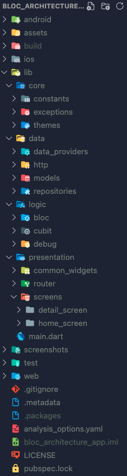

&nbsp;&nbsp;
&nbsp;&nbsp;
<a href="https://choosealicense.com/licenses/mit/" target="_blank"></a>&nbsp;&nbsp;
&nbsp;&nbsp;


# BLoC Architecture App

</img>

This repository imitate the starting project structure for every flutter applications that I have developed using the <b> BLoC </b> package. I am following the official [documentation](https://bloclibrary.dev/#/architecture) of this BLoC package for designing the folder structure. For any information on BLoC library I would strongly suggest you to follow this [documentation](https://bloclibrary.dev).

This project contains everything that you will need in order to immediately start developing your bloc-driven application.

<b><h2> About the structure of the project </h2></b>

</img>

```
    lib/
    ├── core/
    │   ├── constants/
    │   │   └── strings.dart
    │   ├── exceptions/
    │   │   └── route_exception.dart
    │   └── themes/
    │       └── app_theme.dart
    ├── data/
    │   ├── data_providers/
    │   │   └── data_provider.dart
    │   ├── http/
    │   │   └── http_client.dart
    │   ├── models/
    │   │   └── model.dart
    │   └── repositories/
    │       └── repository.dart
    ├── logic/
    │   ├── bloc/
    │   │   └── bloc.dart
    │   ├── cubit/
    │   │   └── cubit.dart
    │   └── debug/
    │       └── app_bloc_observer.dart
    ├── presentation/
    │   ├── router/
    │   │   └── app_router.dart
    │   └── screens/
    │       ├── detail_screen/
    │       │   ├── widgets/
    │       │   │   └── detail_widget.dart
    │       │   └── detail_screen.dart
    │       └── home_screen/
    │           ├── widgets/
    │           │   └── home_widget.dart
    │           └── home_screen.dart
    └── main.dart
```

You might notice that some files are just dummy (like api.dart, model.dart).
They are placed there just for git to take the folder structure into consideration.
Leaving those folders empty won't let git to take them into consideration. Since this is mostly a startup project, I was thinking of offering you the standard folder structure from the start. Of course, this may change multiple times, improving every time more and more.
